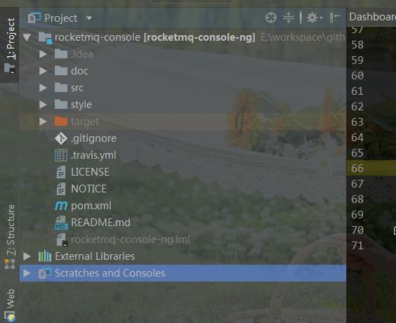
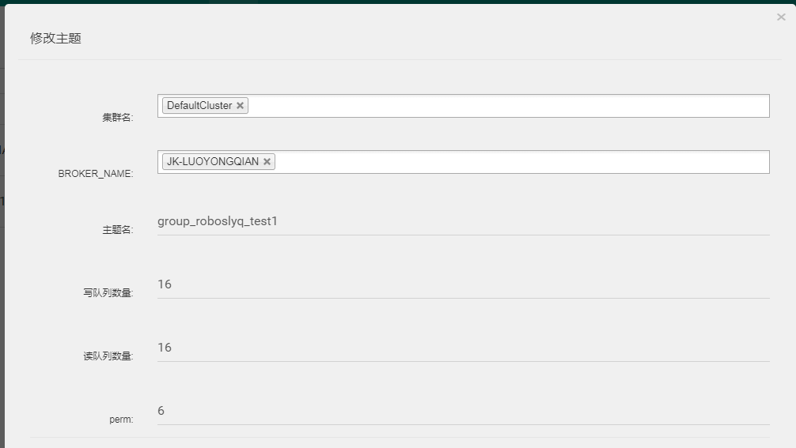
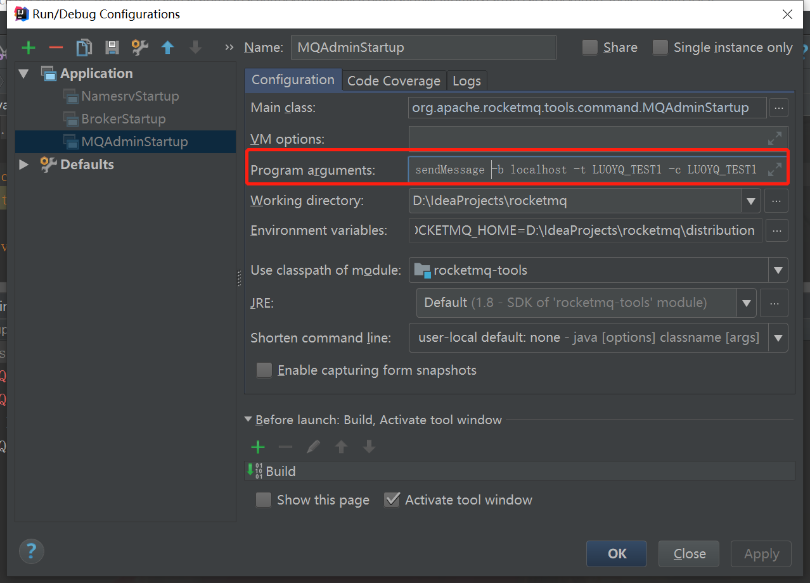

# RocketMQ调试环境搭建

[TOC]

## 前提准备

​		RocketMQ完全基于Java开发的，因此如果想对其源码进行安装，只需要普通的JavaEE相关项目运行环境即可。

- JDK ：>=1.8(必须)
- IDEA:(可以选择其它)
- Maven: >=3（必须，版本只是建议）
- Git:(非必须)

## Fork代码

​		为了学习源码方便自己做笔记，并且自己做的笔记还能永远的保存，我们需要自己的一个仓库，因此我们第一件要做的事情就是从官网github fork一份代码到自己的空间。RocketMQ git官网地址; https://github.com/apache/rocketmq 。

> 如果不知道如何Fork请找度娘。此处默认各位大老肯定知道是怎么Fork代码 的。

## Clone代码

​		将代码下载到本地

> git clone https://github.com/roboslyq/rocketmq.git

## IDEA打开源码

​		将下载好的代码 ，使用IDEA打开。我们可以将pom.xml直接拖拽到DIEA中，即可以打开（当然其它方式也行），然后等待maven自动下载依赖包。

​		Maven的依赖包下载完成之后，代码目录结构如下：


## 启动namesrv

### 配置环境变量

​		配置ROCKETMQ_HOME,当然可以直接配置在计算的环境变量里,我这里直接配置在IDEA中。注意，当前版本必须指定到源码包解压后的`distribution`这个目录 ，因为这个目录有一个`conf`文件夹，保存了启动需要的默认配置。

>  `ROCKETMQ_HOME=E:\workspace\github\rocketmq\distribution`


### 启动

> rocketmq\namesrv\src\main\java\org\apache\rocketmq\namesrv\NamesrvStartup.java


## 启动broker

### 配置环境变量

​		与`namesrv`配置一致,但多了一个Program arguments参数: `-n 127.0.0.1:9786`。指定了`namesrv`服务器的地址和端口。

> `-n 127.0.0.1:9876`

环境变量配置：

> `ROCKETMQ_HOME=E:\workspace\github\rocketmq\distribution`


### 启动


## 可视化管理端安装

>  我们使用官方提供的`rocketmq-extenals`项目中的`rocketmq-console`模块作为我们的可视化管理端。

​		还是一样，先fork到自己的空间，具体的地址为： https://github.com/apache/rocketmq-externals 。

​		然后`git clone`，再然后用IDEA打开`rocketmq-console`这个模块。



### 修改配置

> application.properties

指定`namesvr`服务的端口和地址

```properties
rocketmq.config.namesrvAddr=localhost:9876
```

### 启动

> rocketmq-externals\rocketmq-console\src\main\java\org\apache\rocketmq\console\App.java


### 浏览器访问


> 上图对应运维标签,localhost:9876即对应当前的namesrv

### 新建Topic




## 测试一

> 正常的普通maven项目，使用Java客户端进行相关测试

### Maven配置

```xml
<dependency>
    <groupId>org.apache.rocketmq</groupId>
    <artifactId>rocketmq-client</artifactId>
    <version>4.3.0</version>
</dependency>
```


### 生产者

```java
  public static void syncProducer() throws Exception {
        // 实例化消息生产者Producer
        DefaultMQProducer producer = new DefaultMQProducer("group_roboslyq_test1");
        // 设置NameServer的地址
        producer.setNamesrvAddr("localhost:9876");
        // 启动Producer实例
        producer.start();
        for (int i = 0; i < 100; i++) {
            // 创建消息，并指定Topic，Tag和消息体
            Message msg = new Message("group_roboslyq_test1" /* Topic */,
                    "TagA" /* Tag */,
                    ("Hello RocketMQ " + i).getBytes(RemotingHelper.DEFAULT_CHARSET) /* Message body */
            );
            // 发送消息到一个Broker
            SendResult sendResult = producer.send(msg);
            // 通过sendResult返回消息是否成功送达
            System.out.printf("%s%n", sendResult);
        }
        // 如果不再发送消息，关闭Producer实例。
        producer.shutdown();
    }
```

启动后日志:


### 消费者

```java

    public static void consumer() throws MQClientException {
        // 实例化消费者
        DefaultMQPushConsumer consumer = new DefaultMQPushConsumer("group_roboslyq_test1");

        // 设置NameServer的地址
        consumer.setNamesrvAddr("localhost:9876");

        // 订阅一个或者多个Topic，以及Tag来过滤需要消费的消息
        consumer.subscribe("group_roboslyq_test1", "*");
        // 注册回调实现类来处理从broker拉取回来的消息
        consumer.registerMessageListener(new MessageListenerConcurrently() {
            @Override
            public ConsumeConcurrentlyStatus consumeMessage(List<MessageExt> msgs, ConsumeConcurrentlyContext context) {
                System.out.printf("%s Receive New Messages: %s %n", Thread.currentThread().getName(), msgs);
                // 标记该消息已经被成功消费
                return ConsumeConcurrentlyStatus.CONSUME_SUCCESS;
            }
        });
        // 启动消费者实例
        consumer.start();
        System.out.printf("Consumer Started.%n");
    }
```


### 控制台查询


##　测试二

​		使用rocketMQ自带的demo进行相关测试,在`example`模块下。具体源码路径为：

> rocketmq\example\src\main\java\org\apache\rocketmq\example\quickstart

### producer测试

### consume测试

## 测试三

> 使用RocketMq自己的管理项目。如果是在linux环境下的话，有对应的shell可以运行，但我们已经拿到源码了，就不使用他们的shell了。直接运行源码类即可。以下所有的命令运行均是通过IDEA直接运行类`MQAdminStartup`,然后添加 `Program arguments`相关参数完成 。

### MQAdminStartup

​		我们使用`tools`模块中的`org.apache.rocketmq.tools.command.MQAdminStartup`来进行代码测试。我们相关的命令是放在`main()`方法的`args`参数中。

###　命令配置

将上面的args需要的参数，配置在启动类的`Program arguments`，如下图所示：



>  sendMessage -b localhost  -t  LUOYQ_TEST1 -c LUOYQ_TEST1 -k test -p hello,world  -n localhost:9876 
>
> 注意：sendmessage后面相关的内容都需要你自己先配置好，对应你产自己的环境参数 。比如`-t LUOYQ_TEST1`，这是指已经存在的一个消息主题叫`LUOYQ_TEST1`，如果没有就需要自己新建。可以使用测试一中的可以视化管理界面 创建，当然 我们也可以完全使用命令先创建主题。

### 运行MQAdminStartup


我们可以看到，消息已经发送成功了。可以再可视化界面查看：


### 常见命令

**help命令**

​		帮助命令，可以查看具体的命令使用方式。例如执行如下命令：

> mqadmin help sendMessage 


**消费命令**

​		消费消息，我们可以通过help命令查询消费消息命令的格式。

> mqadmin help sendMessage 


因此，如果我想要消费主题 LUOYQ_TEST1下的所有消息，可以构造如下命令：

> consumeMessage -b localhost  -t  LUOYQ_TEST1  -n localhost:9876   


至此，整个运行环境基本搭建完成！！！


