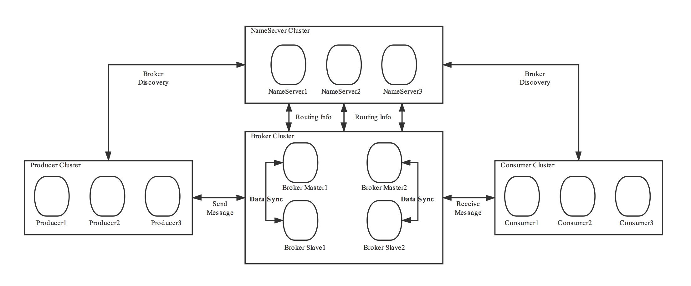
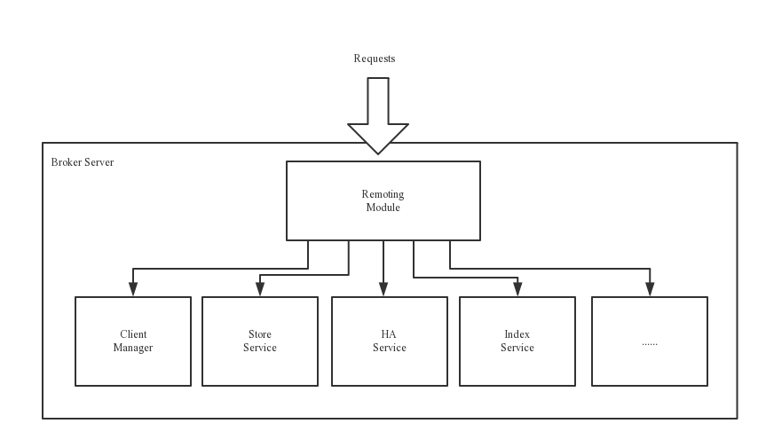
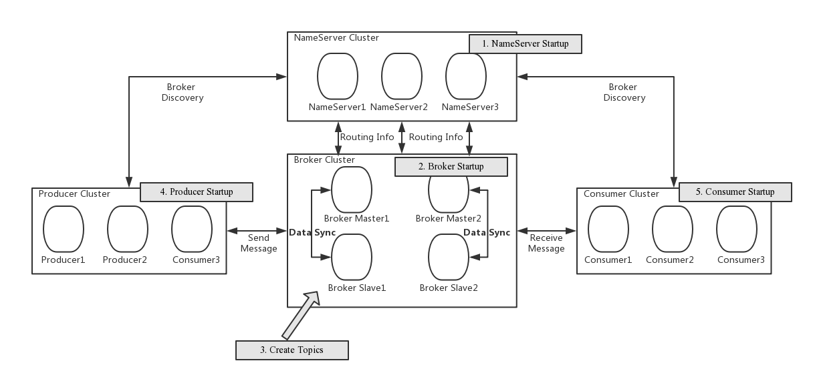
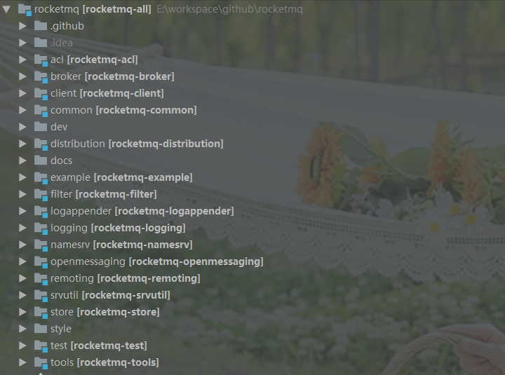

# RocketMQ源码结构

# 架构设计

> 下面技术架构章节来自于[官网]( https://github.com/apache/rocketmq/blob/master/docs/cn/architecture.md )

------

## 技术架构



RocketMQ架构上主要分为四部分，如上图所示:

- **Producer**：消息发布的角色，支持分布式集群方式部署。Producer通过MQ的负载均衡模块选择相应的Broker集群队列进行消息投递，投递的过程支持快速失败并且低延迟。
- **Consumer**：消息消费的角色，支持分布式集群方式部署。支持以push推，pull拉两种模式对消息进行消费。同时也支持集群方式和广播方式的消费，它提供实时消息订阅机制，可以满足大多数用户的需求。
- **BrokerServer**：Broker主要负责消息的存储、投递和查询以及服务高可用保证，为了实现这些功能，Broker包含了以下几个重要子模块。
  - **Remoting Module**：整个Broker的实体，负责处理来自clients端的请求。
  - **Client Manager**：负责管理客户端(Producer/Consumer)和维护Consumer的Topic订阅信息
  - **Store Service**：提供方便简单的API接口处理消息存储到物理硬盘和查询功能。
  - **HA Service**：高可用服务，提供Master Broker 和 Slave Broker之间的数据同步功能。
  - **Index Service**：根据特定的Message key对投递到Broker的消息进行索引服务，以提供消息的快速查询。

- **NameServer**：NameServer是一个非常简单的Topic路由注册中心，其角色类似Dubbo中的zookeeper，支持Broker的动态注册与发现。主要包括两个功能：Broker管理，NameServer接受Broker集群的注册信息并且保存下来作为路由信息的基本数据。然后提供心跳检测机制，检查Broker是否还存活；路由信息管理，每个NameServer将保存关于Broker集群的整个路由信息和用于客户端查询的队列信息。然后Producer和Conumser通过NameServer就可以知道整个Broker集群的路由信息，从而进行消息的投递和消费。NameServer通常也是集群的方式部署，各实例间相互不进行信息通讯。Broker是向每一台NameServer注册自己的路由信息，所以每一个NameServer实例上面都保存一份完整的路由信息。当某个NameServer因某种原因下线了，Broker仍然可以向其它NameServer同步其路由信息，Producer,Consumer仍然可以动态感知Broker的路由的信息。

  > 个人认为Rocket这一套构架，原理完全可以类比DUBBO RPC+注册中心那一套。
  >
  > DUBBO注册中心 <---->  NameServer
  >
  > DUBBO(消费者) <------->Producer/Consumer
  >
  > DUBBO(生产者)<---->Broker
  >
  > 即：客户端(Producer/Consumer)通过注册中(Namesrv)获取服务提供者(Broker)信息，然后通过服务提供者进行相关服务。

2 部署架构



### RocketMQ 网络部署特点

- NameServer是一个几乎无状态节点，可集群部署，节点之间无任何信息同步。
- Broker部署相对复杂，Broker分为Master与Slave，一个Master可以对应多个Slave，但是一个Slave只能对应一个Master，Master与Slave 的对应关系通过指定相同的BrokerName，不同的BrokerId 来定义，BrokerId为0表示Master，非0表示Slave。
  - Master也可以部署多个。
  - 每个Broker与NameServer集群中的所有节点建立长连接，定时注册Topic信息到所有NameServer。
  -  注意：当前RocketMQ版本在部署架构上支持一Master多Slave，但只有BrokerId=1的从服务器才会参与消息的读负载。
- Producer与NameServer集群中的其中一个节点（随机选择）建立长连接，定期从NameServer获取Topic路由信息，并向提供Topic 服务的Master建立长连接，且定时向Master发送心跳。Producer完全无状态，可集群部署。
- Consumer与NameServer集群中的其中一个节点（随机选择）建立长连接，定期从NameServer获取Topic路由信息，并向提供Topic服务的Master、Slave建立长连接，且定时向Master、Slave发送心跳。Consumer既可以从Master订阅消息，也可以从Slave订阅消息，消费者在向Master拉取消息时，Master服务器会根据拉取偏移量与最大偏移量的距离（判断是否读老消息，产生读I/O），以及从服务器是否可读等因素建议下一次是从Master还是Slave拉取。

结合部署架构图，描述集群工作流程：

- 启动NameServer，NameServer起来后监听端口，等待Broker、Producer、Consumer连上来，相当于一个路由控制中心。
- Broker启动，跟所有的NameServer保持长连接，定时发送心跳包。心跳包中包含当前Broker信息(IP+端口等)以及存储所有Topic信息。注册成功后，NameServer集群中就有Topic跟Broker的映射关系。
- 收发消息前，先创建Topic，创建Topic时需要指定该Topic要存储在哪些Broker上，也可以在发送消息时自动创建Topic。
- Producer发送消息，启动时先跟NameServer集群中的其中一台建立长连接，并从NameServer中获取当前发送的Topic存在哪些Broker上，轮询从队列列表中选择一个队列，然后与队列所在的Broker建立长连接从而向Broker发消息。
- Consumer跟Producer类似，跟其中一台NameServer建立长连接，获取当前订阅Topic存在哪些Broker上，然后直接跟Broker建立连接通道，开始消费消息。


# 源码结构

> 再了解了RocketMQ架构的相关相关之后，我们就可以看出Rocket的源码是怎么分包的。并且上面部分术语，比如Producer,Consumer,Broker等基本概念在整个MQ界是通用的，可以扩展到其它MQ产品。



##　代码量统计

> IDEA 中，使用sta

## 模块说明

| 模块名称        | 说明                                                         |
| --------------- | ------------------------------------------------------------ |
| acl             | 用户角色权限控制                                             |
| <B>broker</B>   | 核心模块，主要负责消息的存储、投递和查询以及服务高可用保证等。可以认为一个RocketMQ服务（服务器）就是一个broker相关进程。对consumer和producer来说是服务端，接收producer发来的消息并存储，同时consumer来这里拉取消息（broker启动进程） |
| <B>client</B>   | 客户端，主要包含Producer和Consumer的实现,接收消息和发送消息  |
| common          | 通用的工具包                                                 |
| distribution    | 部署实例相关文件（非源码）,因此相关的配置文件均在这里。所以源码调试启动时，需要打比赛home路径到这个目录之下。 |
| example         | Demo示例                                                     |
| filter          | 消息过滤器模块。对生产者几乎没有影响，主要是消费都可以通过filter过滤掉自己不需要关心的消息。 |
| logappender     | 日志组件Appender扩展。主要是针对logback.xml,log4j.xml等配置文件中的Appender配置。目前支持3种：log4j、log4j2、logback。 |
| logging         | 日志实现相关类,供其它模块使用                                |
| <B>namesrv</B>  | 注册中心（namesrv启动进程）                                  |
| openmessageing  | 消息开放标准（由阿里提出，目前还在发展中。因为MQ产品太多了，所以需要一个规范化的标准来统一不同MQ之前的交互） |
| <B>remoting</B> | 网络模块，对远程调用的封装(底层是netty)。使用FastJSON做序列化，自定义二进制协议 |
| srvutil         | namesrv的工具包。只有一个包`org.apache.rocketmq.srvutil`     |
| <B>store</B>    | 存储实现: 消息存储，索引存储，commitLog存储。                |
| tools           | 命令行工具，对主题的维护，对消息的发送消费等                 |
| dev             | 开发者信息（非源码）                                         |

**acl**使用

- broker开启acl

  - broker.conf中添加配置：aclEnable=true

  - 修改配置plain_acl.yml

    - ```yaml
      globalWhiteRemoteAddresses:
      - 10.10.103.*
      - 192.168.0.*
      
      accounts:
      - accessKey: RocketMQ
        secretKey: 12345678
        whiteRemoteAddress:
        admin: false
        defaultTopicPerm: DENY
        defaultGroupPerm: SUB
        topicPerms:
        - topicA=DENY
        - topicB=PUB|SUB
        - topicC=SUB
        - LUOYQ_TEST1=PUB|SUB
        groupPerms:
        # the group should convert to retry topic
        - groupA=DENY
        - groupB=PUB|SUB
        - groupC=SUB
        - Test_Group=PUB|SUB
      
      - accessKey: rocketmq2
        secretKey: 12345678
        whiteRemoteAddress: 192.168.1.*
        # if it is admin, it could access all resources
        admin: true
          
      ```

- 生产者使用acl（通过RpcHook模式）

  - 通过RpcHook，在生产者生产消息之前 ，将对应的acl信息存入到ext信息中进行保存。然后broker从ext中提取出对应的acl信息，进而进行校验 。

  - ```java
    public static void producer() throws MQClientException {
        DefaultMQProducer producer = new DefaultMQProducer("Test_Group", getAclRPCHook());
        producer.setNamesrvAddr("127.0.0.1:9876");
        producer.start();
    
        for (int i = 0; i < 128; i++)
            try {
                {
                    Message msg = new Message("LUOYQ_TEST1",
                        "TagA",
                        "OrderID188",
                        "Hello world".getBytes(RemotingHelper.DEFAULT_CHARSET));
                    SendResult sendResult = producer.send(msg);
                    System.out.printf("%s%n", sendResult);
                }
    
            } catch (Exception e) {
                e.printStackTrace();
            }
    
        producer.shutdown();
    }
    // AclClientRPCHook是acl模块中的一个类，供用户使用
        static RPCHook getAclRPCHook() {
            return new AclClientRPCHook(new SessionCredentials(ACL_ACCESS_KEY,ACL_SECRET_KEY));
        }
    
    
    ```

**filter**使用

```java
public class SqlFilterConsumer {

    public static void main(String[] args) throws Exception {
        DefaultMQPushConsumer consumer = new DefaultMQPushConsumer("please_rename_unique_group_name");
        consumer.setNamesrvAddr( "localhost:9876" );
        // Don't forget to set enablePropertyFilter=true in broker
        // 记得，不要忘记在broker中的enablePropertyFilter参数设置为true。
        consumer.subscribe("SqlFilterTest",
            MessageSelector.bySql("(TAGS is not null and TAGS in ('TagA', 'TagB'))" +
                "and (a is not null and a between 0 and 3)"));

        consumer.registerMessageListener( (MessageListenerConcurrently) (msgs, context) -> {
            System.out.printf("%s Receive New Messages: %s %n", Thread.currentThread().getName(), msgs);
            return ConsumeConcurrentlyStatus.CONSUME_SUCCESS;
        } );

        consumer.start();
        System.out.printf("Consumer Started.%n");
    }
}
```

> 注意上述代码中的` MessageSelector.bySql("(TAGS is not null and TAGS in ('TagA', 'TagB'))"                 "and (a is not null and a between 0 and 3)")`这一段代码 ，即可以达到过滤效果。


**logappender**使用，以log4j.xml配置为例：

> ```xml
> <appender name="mqAppender1" class="org.apache.rocketmq.logappender.log4j.RocketmqLog4jAppender">
>     <param name="Tag" value="yourTag" />
>     <param name="Topic" value="yourLogTopic" />
>     <param name="ProducerGroup" value="yourLogGroup" />
>     <param name="NameServerAddress" value="yourRocketmqNameserverAddress"/>
>     <layout class="org.apache.log4j.PatternLayout">
>         <param name="ConversionPattern" value="%d{yyyy-MM-dd HH:mm:ss}-%p %t %c - %m%n" />
>     </layout>
> </appender>
> 
> <appender name="mqAsyncAppender1" class="org.apache.log4j.AsyncAppender">
>     <param name="BufferSize" value="1024" />
>     <param name="Blocking" value="false" />
>     <appender-ref ref="mqAppender1"/>
> </appender>
> ```

